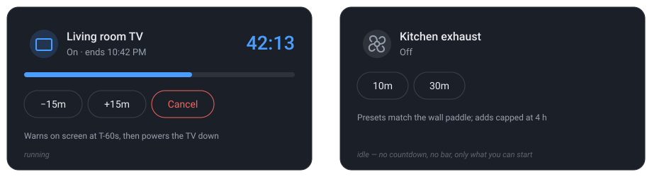

# Timer Panel Card

A Lovelace card that turns a Home Assistant `timer` entity into one self-contained panel: the device
it belongs to, a live countdown, a bar that drains as time runs out, and a set of buttons that
changes with the timer's state.

The point is the two states. **Idle**, the panel is a row of presets — the things you might start.
**Running**, those are replaced by the things you might do to a running timer: adjust it, stop it.
You never look at a control that does nothing right now, and a dashboard full of idle timers doesn't
turn into a wall of identical buttons.



[](https://my.home-assistant.io/redirect/hacs_repository/?owner=JustBeanie&repository=timer-panel-card&category=frontend)

## Why not a template card

A `timer` entity emits **no state changes while it counts down** — only `idle → active` and back. A
template-based card therefore has nothing to re-render on except its `now()` reference, and Home
Assistant rate-limits those to once a minute. This card computes the remaining time from
`finishes_at` on a one-second interval in the browser, the same way Home Assistant's own timer row
does, so it costs nothing on the backend and never looks frozen.

## Install

### HACS

Click the button above, or add it by hand:

1. HACS → three-dot menu → **Custom repositories**
2. Repository `JustBeanie/timer-panel-card`, type **Dashboard**
3. Find "Timer Panel Card" in HACS and download it
4. Hard-refresh the browser (Ctrl/Cmd + Shift + R)

### Manual

Copy `dist/timer-panel-card.js` to `<config>/www/` and add a dashboard resource pointing at
`/local/timer-panel-card.js`, type **JavaScript module**.

## Options

| Option | Type | Default | Description |
|---|---|---|---|
| `type` | string | — | `custom:timer-panel-card` |
| `timer` | string | **required** | A `timer.*` entity |
| `device` | string | — | Companion entity — the TV, fan or light the timer governs. Any domain. Drives the second line and the idle icon tint |
| `name` | string | device / timer name | Panel title |
| `icon` | string | timer's icon | Any `mdi:` icon |
| `secondary` | string | derived | Replaces the auto-generated second line |
| `device_attribute` | string | — | Extra attribute appended to the second line while the device is on, e.g. `app_name` |
| `footer` | string | — | Small muted caption under the buttons. Good for a caveat you'd otherwise forget |
| `caution_seconds` | number | `300` | Below this, the bar and countdown turn `--warning-color` |
| `warn_seconds` | number | `60` | Below this, they turn `--error-color` |
| `idle_buttons` | list | `[]` | Shown while the timer is idle |
| `running_buttons` | list | `[]` | Shown while the timer is active **or paused** |

Tapping the header opens the timer's more-info dialog, where Home Assistant's own duration editor
lives.

### Buttons

Each entry takes a `label`, an optional `icon`, an optional `style`, and an `action`.

| Key | Description |
|---|---|
| `label` | Button text |
| `icon` | Optional `mdi:` icon, drawn before the label |
| `style` | `danger` (red) or `accent` (themed). Omit for the default outline |
| `action` | A Home Assistant action config |

Supported actions: `perform-action`, `more-info`, `toggle`, `navigate`, `url`, `none`.

**Targets.** A `perform-action` with no `target` targets the card's own `timer` — which is what you
want for `timer.start`, `timer.cancel`, `timer.pause`. When you're calling a script or an entity in
another domain, set the target explicitly, and pass **`target: {}`** for a script that takes entity
IDs as fields rather than as a target:

```yaml
- label: "+15m"
  action:
    action: perform-action
    perform_action: script.add_time      # a script with `timer` and `duration` fields
    target: {}                           # no target — the script gets everything in `data`
    data:
      timer: timer.tv
      duration: { minutes: 15 }
```

## Examples

### A TV sleep timer

```yaml
type: custom:timer-panel-card
timer: timer.living_room_tv
device: media_player.living_room_tv
name: Living room TV
icon: mdi:television
footer: Warns on screen at T-60s, then powers the TV down
idle_buttons:
  - label: 30m
    action: { action: perform-action, perform_action: timer.start, data: { duration: "00:30:00" } }
  - label: 1h
    action: { action: perform-action, perform_action: timer.start, data: { duration: "01:00:00" } }
  - label: 2h
    action: { action: perform-action, perform_action: timer.start, data: { duration: "02:00:00" } }
running_buttons:
  - label: "−15m"
    action: { action: perform-action, perform_action: timer.change, data: { duration: "-00:15:00" } }
  - label: "+15m"
    action: { action: perform-action, perform_action: timer.change, data: { duration: "00:15:00" } }
  - label: Cancel
    style: danger
    action: { action: perform-action, perform_action: timer.cancel }
```

### An extractor fan

Note that stopping the fan and cancelling the timer are different things — here the red button turns
the fan off and leaves the timer alone.

```yaml
type: custom:timer-panel-card
timer: timer.kitchen_exhaust
device: fan.kitchen_exhaust
name: Kitchen exhaust
icon: mdi:fan
caution_seconds: 120
idle_buttons:
  - label: 10m
    action: { action: perform-action, perform_action: timer.start, data: { duration: "00:10:00" } }
  - label: 30m
    action: { action: perform-action, perform_action: timer.start, data: { duration: "00:30:00" } }
running_buttons:
  - label: Fan off
    style: danger
    icon: mdi:fan-off
    action:
      action: perform-action
      perform_action: fan.turn_off
      target: { entity_id: fan.kitchen_exhaust }
```

## Notes

- **Colours are theme variables**, never hard-coded: `--primary-color`, `--warning-color`,
  `--error-color`, `--divider-color`, `--secondary-text-color`. The card renders a real `<ha-card>`,
  so it inherits whatever your theme does to cards.
- **The bar is proportional to the timer's `duration` attribute**, so a service that extends a
  running timer rescales the bar instead of overflowing it.
- In a **sections** view the panel asks for the full column width (`min_columns: 6`), so it lines up
  with tiles rather than sitting at half width.
- The second line is derived: the device's state, then `ends 10:42 PM` while running, `paused` when
  paused, or `no timer set` when the timer is idle and the device is on. `secondary` overrides all
  of it.

## License

MIT
